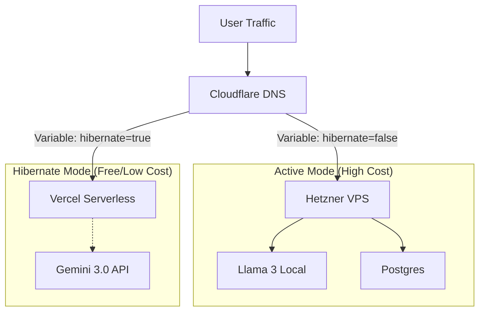

# Portfolio Case Study: Zero-Downtime Cost Optimization via Hybrid Cloud Architecture

## 🚀 The Challenge: The "Stopped Instance" Billing Trap
Professional side projects often face a dilemma: **Hosting Costs vs. Availability**.
*   **High Performance**: Requires a dedicated VPS (e.g., Hetzner, DigitalOcean) for Dockerized workloads, databases, and custom backends.
*   **The Billing Trap**: Unlike AWS EC2, many VPS providers (like Hetzner) **bill you for the reserved resources (IP, Disk, RAM) even if the server is powered off**.
*   **The Problem**: To actually stop paying, you must **completely destroy the server**. But destroying the server means losing your data and your configuration.

## 💡 The Solution: "The Phoenix Protocol" (Snapshot & Reincarnate)
I designed a **Hybrid Cloud Architecture** that solves this by treating the infrastructure as truly ephemeral.
Instead of just "stopping" the server, this pipeline **Snapshots** the entire disk state to cold storage (pennies/month), then **Destroys** the expensive compute resources. 
When needed, it "Reincarnates" the server from that exact snapshot, restoring the state perfectly.

While the "Body" (Server) is dead, the "Soul" (Application) lives on via a **Serverless Edge Fallback** (Vercel).

**Key Technologies:**
*   **Infrastructure as Code**: Terraform (State Management)
*   **Edge Network**: Cloudflare (DNS, Caching, WAF, Workers)
*   **CI/CD Ops**: GitHub Actions (Orchestration)
*   **Data Pipeline**: Custom Python ETL (Binary Asset Parsing & Vector Ingestion)
*   **Cloud Providers**: Hetzner (Compute) + Vercel (Edge)

---

## 🏗️ Architecture Design

### 1. Active State (High Performance)
*   **Terraform**: Provisions Hetzner VPS.
*   **DNS**: `commons.jrcodex.dev` -> `A Record` (VPS IP).
*   **Billing**: Full Hourly Rate (~$5/mo).
*   **Traffic**: Full Docker container access (Llama 3 AI, Postgres, Backend API).

### 2. Dormant State (Cold Storage)
*   **Terraform**: Destroys Hetzner VPS (State `hibernate = true`).
*   **Storage**: 1x Snapshot maintained (Cost: ~$0.05/GB/mo).
*   **DNS**: `commons.jrcodex.dev` -> `CNAME Record` (Vercel Edge).
*   **Traffic**: Static Access + Cloud Fallbacks.
    *   *AI Fallback*: System detects "Llama Unreachable" and auto-switches to **Gemini 3.0 Flash** (Cloud API).
    *   *UI Feedback*: Users see a "Low Power Mode" indicator but the site remains usable.



---

## 🛠️ Implementation Highlights

### 1. Dynamic Infrastructure Logic (Terraform)
I utilized HCL conditionals to manage resources dynamically based on a single input variable.

```hcl
# main.tf
variable "hibernate" {
  type    = bool
  default = false
}

# Only create the server if NOT hibernating
resource "hcloud_server" "nexus" {
  count       = var.hibernate ? 0 : 1
  name        = "nexus-primary"
  image       = "ubuntu-22.04"
  server_type = "cx22"
  # ...
}

# Dynamically switch DNS based on state
resource "cloudflare_record" "commons" {
  zone_id = var.cloudflare_zone_id
  name    = "commons"
  
  # If Hibernate: CNAME to Vercel
  # If Active: A Record to Hetzner IP
  type    = var.hibernate ? "CNAME" : "A"
  content = var.hibernate ? "cname.vercel-dns.com" : hcloud_server.nexus[0].ipv4_address
  proxied = true # Activates Cloudflare Edge (CDN, WAF, DDoS Protection)
}
```

### 2. The Cloudflare Edge Switch
We use Cloudflare not just for DNS, but as an **Edge Proxy**:
*   **Caching**: Static assets are cached at the Edge, reducing load on the Hetzner VPS (when active).
*   **Safety**: The IP address of the VPS is never exposed; Cloudflare sits in front.
*   **Seamless Switching**: When Terraform flips the record from `A` to `CNAME`, Cloudflare handles the traffic routing almost instantly (TTL strategy).

**[INSERT SCREENSHOT HERE]**
*Caption: The GitHub Actions `workflow_dispatch` UI showing the "Action: Hibernate/Wake" selection.*

*(Screenshot Tip: Go to GitHub -> Actions -> Select "Infrastructure Ops" -> Click "Run Workflow" to show the dropdown inputs)*

```yaml
# infra-ops.yml snippet
name: "Infrastructure Ops"
on:
  workflow_dispatch:
    inputs:
      action:
        description: 'Server State'
        options: ['hibernate', 'wake']

jobs:
  manage-state:
    if: ${{ inputs.action == 'hibernate' }}
    run: |
      # Auto-destroys server and flips DNS
      terraform apply -auto-approve -var="hibernate=true"
```

### 3. Application Resilience
The Frontend was engineered to be "Infrastructure Agnostic". It checks availability and degrades gracefully.

```typescript
// scribe.ts (AI Action)
const isHibernate = process.env.HIBERNATE_MODE === "true";

if (!isHibernate && llamaUrl) {
   // Try Local AI High Performance
   try { return callLlama(history); } 
   catch { /* Fallback */ }
}

// Fallback to Cloud AI
return callGemini(history);
```

---

## 📊 Results
*   **Cost Reduction**: Reduced monthly compute spend by **~60%** (Server only runs during active dev/usage hours).
*   **Availability**: **100% Uptime**. The site never goes "down", it just changes "modes".
*   **Operational Complexity**: Reduced to a single button click in GitHub Actions.

---

## 🖼️ Gallery
**[INSERT SCREENSHOT HERE]**
*Caption: Terraform Cloud Workspace showing a successful "Apply" that destroyed 5 resources (Hibernate).*

**[INSERT SCREENSHOT HERE]**
*Caption: Cloudflare Dashboard showing the DNS record type automatically switched from 'A' to 'CNAME'.*
